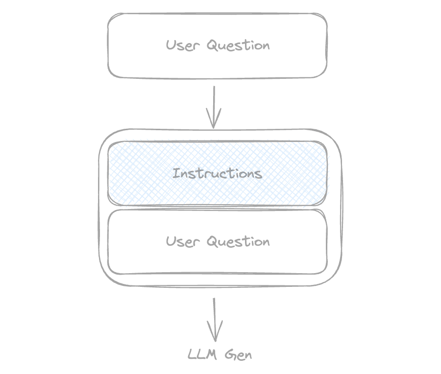
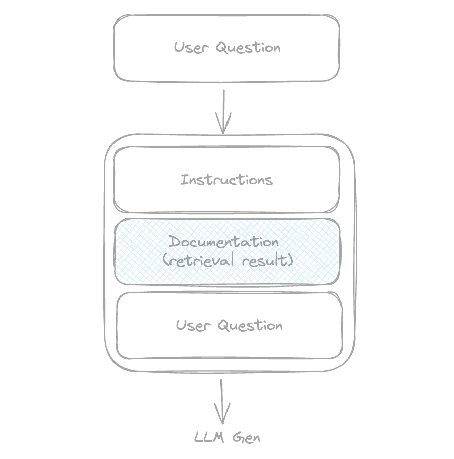
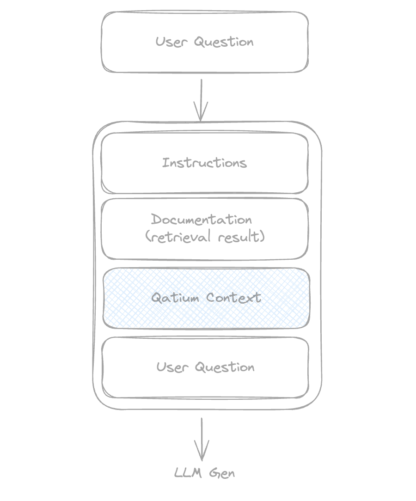

Q is the AI assistant in Qatium. They can answer user questions in natural language, help resolve issues, and even operate the network.

Q uses conversational generative AI from OpenAI to produce the text.

To maintain a consistent AI personality and focus usage on Qatium, we created an assistant. This involves appending a set of instructions to user questions before they are sent to the LLM.



Instructions include things like:

- You are Q, the Qatium assistant
- You are helpful and fun
- Reject any requests that are not about Qatium
- ...

## How does Q know so much about Qatium?

Q knows the Qatium information they need to answer the user questions because we inject it in the prompt in a similar way we injected the instructions.

This technique is called RAG from retrieval augmented generation.

When the user writes a question we search the Qatium help center for pieces of content that may be used to answer that question (Retrieval).

Then we concatenate it to the prompt together with the instructions and the question (augmentation) and then we finally ask the LLM for the answer (generation).




To identify helpful parts of the help center for user questions, we cannot rely on keyword searches as they often fail.

Instead of this, we process all the help center information, generate embeddings that are vector representations of the information and store them in a vector database.

We generate embeddings for user questions as well, using these to search the vector database.

Retrieval is a service provided by OpenAI too so we only need to periodically extract all the documents from the help center, convert them to markdown and upload them.

## How Q knows about the user and the network?

You probably guessed it right, we also concatenate this information to the prompt too.

We call this part the Qatium context. It includes the user name, the network name, which layers are visible, the selected asset, any asset with warnings...



## How can Q operate the network?

Armed with this information, Q can answer a wide range of questions and assist with your Qatium needs. But what's better than smart assistance? Clearly, having someone else do the work.

OpenAI chatGPT is trained to be able to use function calling. You can add a list of commands (tools) that are available to the AI and Q will use them when they see the need.

But how does this work?

First we define a list of commands. This growing list includes the command name and description and the name and description of the params. Eg one command would be like this:

```
commandName: "selectAsset",
description: "Selects the asset and opens its popover",
params: [{
  name: "assetId",
  description: "The identifier of the asset"
}]
```

Of course the commands are also part of the prompt:


Additionally we define the code we need to execute:

```
const selectAsset = (params) => sdk.map.selectElement(params.assetId)
```

We use the OpenAI API like this:

- Create a thread
- Add messages to the thread with the Qatium context and the user question
- Execute a run with SSE streaming

At this point the LLM generates the answer token by token. It starts to stream text and we display this text to the user.

If the LLM didn't find a need for tools, the run will be completed and the question answered.

If it wants to use a tool, the run response would be: [required_action](https://platform.openai.com/docs/api-reference/runs/object#runs/object-required_action) with the tool(s) to be used and their params. Then we execute the code associated with that tool(s) and call [submit_tool_outputs](https://platform.openai.com/docs/api-reference/runs/submitToolOutputs) with the results of executing the commands.

The AI will run again, the response can be a textual answer for the user or could request more tools.

## Limitations

### Indeterminism

Generative AI may produce different results each time it is used. It's not possible to guarantee that the results provided to the user are always correct.

We are following a "best effort" approach. We manually test and iterate in our prompts and command descriptions until we see the results are right consistently.

LLMs are evolving fast and every new version improves reliability. My personal bet is that eventually this limitation would become insignificant.

### Cost

The final prompt is composed by instructions + documentation retrieval+ Qatium context + commands + user question. This may imply a lot of tokens to be used.

The costliest aspect is retrieving documentation. We saved half the tokens used by changing the maximum number of chunks from 20 to 5 and it didn't have a visible effect in the response quality.

When a second question is added to a thread, the previous messages count as input tokens too. To prevent an exponential growth of consumption we don't add again the commands and we only add a diff of the Qatium context. Based on some consumption measurements, I see that OpenAI does not accumulate retrieval data. So the consumption of the second question in a thread is very similar to the first, not growing exponentially.

### Model updates

Most of the updates on LLMs are better In every aspect. However, not all updates are improvements; for example, some versions of chatGPT were 'lazier' than their predecessors.

Now there are several initiatives to benchmark and compare LLMs that help predict the overall results. But it's impossible to ensure that changes in behavior of the LLM won't worsen Q results.

Writing e2e tests could help us but they are challenging because:

- Cost - A big suite would use a lot of tokens
- Indeterminism - Sometimes the AI finds different ways to complete the task so the test expectations are more difficult to write

### Context size and complexity

Qatium handles networks that sometimes weight 10s or even 100s MBs.

If we provided the whole network to the AI for a full understanding of it, it would be extremely expensive and we may even reach the maximum size of the LLM context.

Simpler questions don't need that much information but requests like "Increase the min pressure in this DMA with the less amount of losses" require knowledge about the network topology. Even having the whole network it's possible that current AIs are not capable of providing good results to these kind of questions without extra help.

This is a problem we are still working on.
