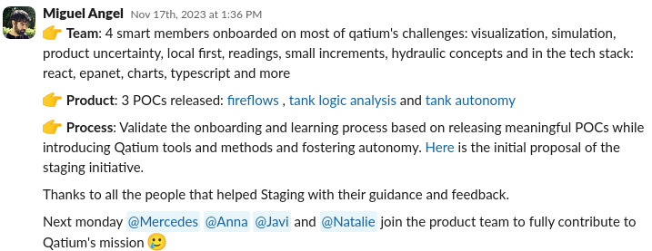

Natalie and Miguel Angel talked about an internal initiative in the [VLCtechfest 2024](https://vlctechfest.org/) conference held in Valencia, here we present a quick summary of the talk. You can find the [video recording here](https://www.youtube.com/watch?v=h7enIXDPVzQ) and the [slides here](/cultivandoeltalento.pdf)

## Hiring challenges

Entering the hiring market of software developer roles involves tons of work because the demand is huge. Given this context, candidates have many options and will accept interviews with the most appealing jobs. That is why the effort it takes to attract good profiles is increasing.

On top of that, the standard route leads to having a uniform team where the team members share the same views and **today's consumers are demanding well rounded products created by a diverse team**.

## Introducing Qatium's plan

In order to address these challenges the Qatium team created an initiative to hire talented engineers to complement the current team and train them so they can participate fully in the engineering team.  The goal was to introduce not only programming languages but also the team conventions, domain knowledge, as well as the team culture.

## The map meets the terrain

The idea was to incrementally increase technologies used and skills required, while gaining independence and confidence. To achieve this, the new team worked on 3 projects over the course of 5 months: ‘[Fireflows](https://labs.qatium.com/apps/fireflow)’, ‘[Control Logic](https://labs.qatium.com/apps/control-logic)’ and ‘Tank emptying’.

Not only did these projects allow us (participants of this initiative) to understand some **core technologies** that are used in the main web app (such as typescript, docker, mapbox and the hydraulic modeling library EPANET), and **core skills** such as running hydraulic simulations and effective visualization, it also gave us a taste of what life at Qatium was like.

We learned core practices like test driven development and pair programming, learn to collaborate with other teams, how to effectively communicate project outcomes and importantly, taught us **autonomy and confidence** in our skills.

We were taught that at Qatium, mentorship, learning and seeking out help when needed are our responsibilities. As such we were encouraged to find our own mentors within the company and take ownership of our career progression. That, alongside invaluable peer support within the initiative, is what I believe led us to thrive once integrated in the engineering team at the end of the 5 months.

## The inside view

The experience of the initiative was overall positive, allowing us participants to grow in skills and confidence while being stimulating and gratifying. Not to say that it wasn’t overwhelming at times, and quite challenging overall! But importantly the initiative gave us **space to explore new technologies and techniques**, and make mistakes while doing it. It gave us the time and freedom to learn, build on each other's skills, understand why we are doing things a certain way, and own our decisions.

In the end we all joined the main engineering team, in different areas based on our strengths and interests. We all became active team members and got to bring our unique backgrounds and perspectives to the product.

## Results

